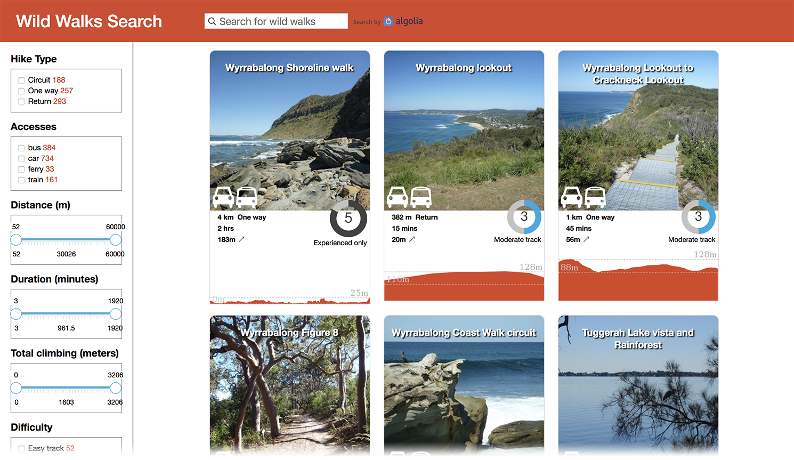

# wild-walks-search

An attempt to build a multi-criteria search feature on top of http://www.wildwalks.com/

https://cedric25.github.io/wild-walks-search/



## Web scraping

Code under the `/import` folder.

1. Requests to wildwalks.com
2. Parse html with [cheerio](https://github.com/cheeriojs/cheerio)
3. Inject hikes to [algolia](https://www.algolia.com/)

### Run

(Algolia 'applicationID' and 'apiKey' need to be set as env vars)
```
username=XXX password=XXX node import/index
```

## Search UI

Static HTML / CSS / JS.
We tried to recreate the original style as much as possible.

Refinement lists and range sliders come from Algolia [instantsearch](https://github.com/algolia/instantsearch.js/) library.

### Deployed

On Github pages: [https://cedric25.github.io/wild-walks-search/](https://cedric25.github.io/wild-walks-search/)

## Authors

- [Cédric Nicoloso](https://github.com/cedric25)
- [Thibaut Géry](https://github.com/ThibautGery)
